  

<h1 align="center">Emir Değirmenci</h1>

  <em>Building AI-powered products, data-heavy workflows, and agentic systems.</em>

  AI-powered products&nbsp;·&nbsp;Data systems&nbsp;·&nbsp;Workflow automation&nbsp;·&nbsp;Agentic systems

  
  

## Focus

- End-to-end AI-powered products and internal platforms
- Data ingestion, cleaning, transformation, retrieval, and evaluation workflows
- Agentic systems, tool use, and orchestration
- Automation of operational and knowledge workflows
- Backend services and integrations

## Hobby Lab

- Raspberry Pi and ESP home experiments
- Self-hosted home server
- Personal infrastructure, sensors, automations, and small hardware projects

## What I Enjoy

Systems that hide complexity behind clear interfaces: grounded in real data,
designed around real workflows, and built to keep running after the demo.
